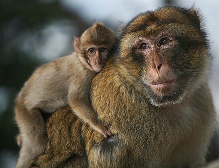

# Monkey

---
***Monkey is a common name that may refer to most mammals of the infraorder Simiiformes, also known as simians. Traditionally, all animals in the group now known as simians are counted as monkeys except the apes. Thus monkeys, in that sense, constitute an incomplete paraphyletic grouping; however, in the broader sense based on cladistics, apes (Hominoidea) are also included, making the terms monkeys and simians synonyms in regard to their scope.***